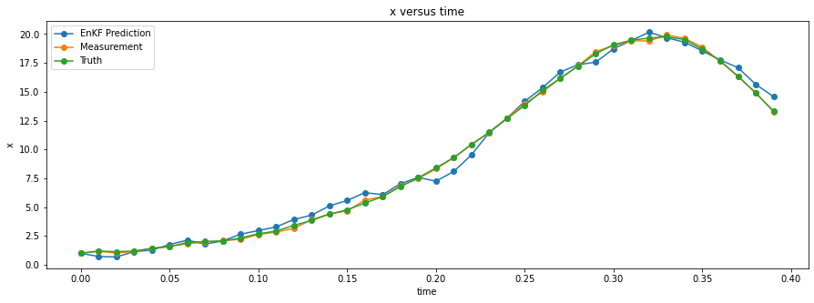
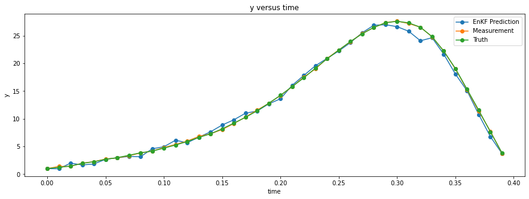
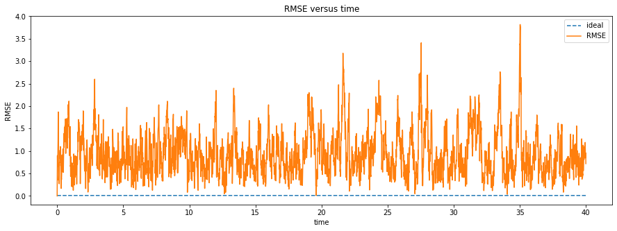
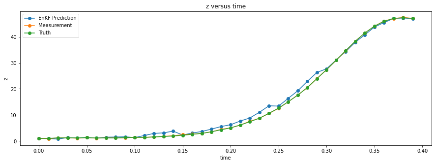
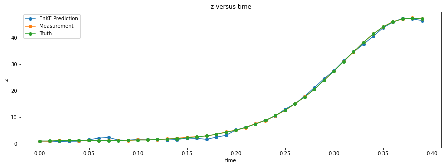
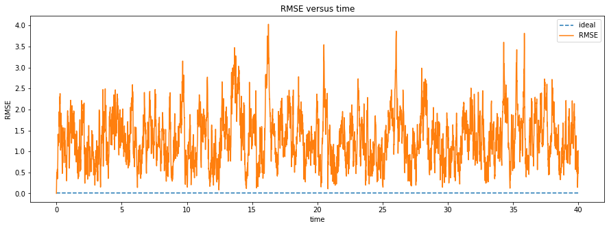
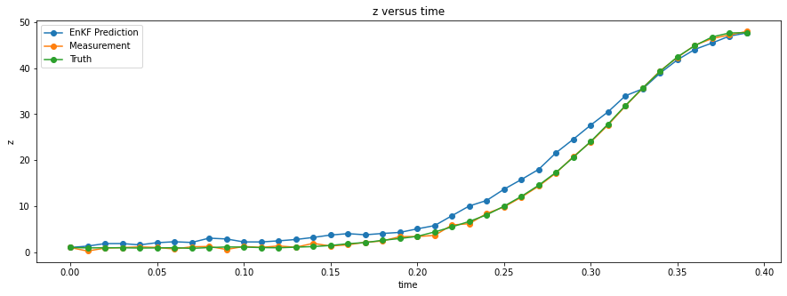
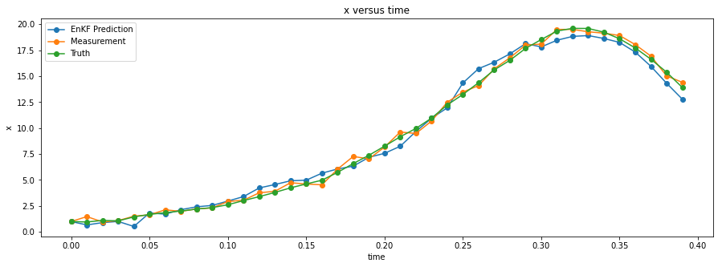
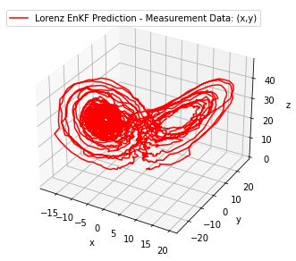

# MATH 582 Mini Project 4 - Group 1


```python
from copy import deepcopy
import numpy as np
import pandas as pd
from numpy.random import multivariate_normal
import matplotlib.pyplot as plt
from sklearn.metrics import mean_squared_error
from math import sqrt
from itertools import product
from IPython.display import display

%matplotlib inline
np.random.seed(333)
```

## Lorenz '63 System of Equations

Below, we define the differential equations that comprise the Lorenz '63 system.


```python
# Define the Lorenz '63 system of differential equations

# constants
sigma=10.
beta=8./3.
rho=28.

# derivative functions
def dxdt(x, y, z, t):
    return sigma * (y - x)

def dydt(x, y, z, t):
    return x * (rho - z) - y

def dzdt(x, y, z, t):
    return x * y - beta * z

lorenz_derivs = [dxdt, dydt, dzdt]
```

## Runge-Kutta 4th Order Solver

In the function below, we define the function that implements the Runge-Kutta 4th order solver. This is used for estimating the solution for a system of differential equations.


```python
# Define the Runge-Kutta order 4 solver

def rk4(state, derivs, t, dt):
    x = list(state)

    args = x + [t]
    k1 = [ dt * f(*args) for f in derivs ]

    args = [ r+0.5*kr for r,kr in zip(x + [t], k1 + [dt]) ]
    k2 = [ dt * f(*args) for f in derivs ]

    args = [ r+0.5*kr for r,kr in zip(x + [t], k2 + [dt]) ]
    k3 = [ dt * f(*args) for f in derivs ]

    args = [ r+kr for r,kr in zip(x + [t], k3 + [dt]) ]
    k4 = [ dt * f(*args) for f in derivs ]

    return np.array( [r+(k1r+2*k2r+2*k3r+k4r)/6 for r,k1r,k2r,k3r,k4r in zip(x,k1,k2,k3,k4)] )
```


```python
# Given a state (x, y, z) and a time step size dt, predict the next state of the system

def lorenz_step(state, dt):
    return rk4(state, lorenz_derivs, 0, dt)
```


```python
def simulate_lorenz_ideal(state, t0, tFinal, dt):
    x0, y0, z0 = state
    steps = int(np.floor((tFinal-t0) / dt))

    t = steps * [0.0]
    x = steps * [0.0]
    y = steps * [0.0]
    z = steps * [0.0]

    x[0],y[0],z[0],t[0] = x0, y0, z0, t0  #Initial system state

    for i in range(1, steps):
        x[i],y[i],z[i] = lorenz_step( (x[i-1],y[i-1],z[i-1]) , dt)

    return x, y, z, t
```


```python
x0, y0, z0, t0, tFinal, dt = 1., 1., 1., 0., 40., 0.01

x, y, z, t = simulate_lorenz_ideal( (x0, y0, z0) , t0, tFinal, dt)
```


```python
def plot_3d(x, y, z, title):
    fig = plt.figure()
    fig.set_figwidth(10)
    fig.set_figheight(5)
    ax = fig.add_subplot(projection='3d')
    ax.plot(x,y,z,'r',label=title)
    ax.set_xlabel('x')
    ax.set_ylabel('y')
    ax.set_zlabel('z')
    ax.legend()
    plt.show()

plot_3d(x,y,z,'Lorenz Ideal Model Simulation')
```


    

    


```python
def generate_lorenz_data(state, t0, tFinal, dt, q_truth, q_measurement):
    x0, y0, z0 = state
    D = 3
    steps = int(np.floor((tFinal-t0) / dt))

    # noise matrices:
    # Q_truth: The random variation matrix introduced to perturb the ideal model (for the purposes of generating data)
    # Q_measurement: The sampling error matrix of the fictional measurement device
    Q_truth = q_truth * np.eye(D)
    Q_measurement = q_measurement * np.eye(D)

    t = np.zeros(steps)

    # each row is a state vector (x,y,z)
    # X[i] returns the state of step i
    X_ideal = np.zeros((steps, D)) # the ideal system state (no variation introduced)
    X_theoretical = np.zeros((steps, D)) # the ideal system state for a given step, based on previous X_truth
    X_truth = np.zeros((steps, D)) # the true system state (Gaussian random variable with mean of X_theoretical at each step)
    X_measurement = np.zeros((steps, D)) # the noisy measurement at each step (Gaussian random variable with mean of X_truth at each step)

    # initialize system state
    t[0] = t0
    X_ideal[0] = np.array(state)
    X_theoretical[0] = np.array(state)
    X_truth[0] = np.array(state)
    X_measurement[0] = np.array(state)

    for k in range(1, steps):
        t[k] = k * dt
        X_ideal[k] = lorenz_step(X_ideal[k-1], dt)
        X_theoretical[k] = lorenz_step(X_truth[k-1], dt)
        X_truth[k] = multivariate_normal(X_theoretical[k], Q_truth)
        X_measurement[k] = multivariate_normal(X_truth[k], Q_measurement)

    return t, X_ideal, X_theoretical, X_truth, X_measurement
    
```


```python
# Helper functions for EnsembleKalmanFilter class

def pretty_str(label, arr):
    """
    Generates a pretty printed NumPy array with an assignment. Optionally
    transposes column vectors so they are drawn on one line.
    Examples
    --------
    >>> pprint('cov', np.array([[4., .1], [.1, 5]]))
    cov = [[4.  0.1]
           [0.1 5. ]]
    >>> print(pretty_str('x', np.array([[1], [2], [3]])))
    x = [[1 2 3]].T
    """

    def is_col(a):
        """ return true if a is a column vector"""
        try:
            return a.shape[0] > 1 and a.shape[1] == 1
        except (AttributeError, IndexError):
            return False

    if label is None:
        label = ''

    if label:
        label += ' = '

    if is_col(arr):
        return label + str(arr.T).replace('\n', '') + '.T'

    rows = str(arr).split('\n')
    if not rows:
        return ''

    s = label + rows[0]
    pad = ' ' * len(label)
    for line in rows[1:]:
        s = s + '\n' + pad + line

    return s

def outer_product_sum(A, B):
    """
    Computes the sum of the outer products of the rows in A and B.
    Parameters
    ----------
    A : np.array, shape (M, N)
        rows of N-vectors to have the outer product summed
    B : np.array, shape (M, N)
        rows of N-vectors to have the outer product summed
        If it is `None`, it is set to A.
    """
    if B is None:
            B = A

    outer = np.einsum('ij,ik->ijk', A, B)
    return np.sum(outer, axis=0)
```

## Ensemble Kalman Filter (EnKF)

In the cell below, we define a class that implements the functionality of the Ensemble Kalman filter. This class exposes the methods predict() and update(). The predict() method predicts the next time step. The update() method updates the model with a measurement.


```python
class EnsembleKalmanFilter(object):
    """
    This implements the ensemble Kalman filter (EnKF).
    Parameters
    ----------
    x : np.array(dim_x)
        state mean
    P : np.array((dim_x, dim_x))
        covariance of the state
    dim_z : int
        Number of of measurement inputs. For example, if the sensor
        provides you with position in (x,y), dim_z would be 2.
    dt : float
        time step in seconds
    N : int
        number of sigma points (ensembles). Must be greater than 1.
    K : np.array
        Kalman gain
    hx : function hx(x)
        Measurement function. May be linear or nonlinear - converts state
        x into a measurement. Return must be an np.array of the same
        dimensionality as the measurement vector.
    fx : function fx(x, dt)
        State transition function. May be linear or nonlinear. Projects
        state x into the next time period. Returns the projected state x.
    Attributes
    ----------
    x : numpy.array(dim_x, 1)
        State estimate
    P : numpy.array(dim_x, dim_x)
        State covariance matrix
    x_prior : numpy.array(dim_x, 1)
        Prior (predicted) state estimate. The *_prior and *_post attributes
        are for convienence; they store the  prior and posterior of the
        current epoch. Read Only.
    P_prior : numpy.array(dim_x, dim_x)
        Prior (predicted) state covariance matrix. Read Only.
    x_post : numpy.array(dim_x, 1)
        Posterior (updated) state estimate. Read Only.
    P_post : numpy.array(dim_x, dim_x)
        Posterior (updated) state covariance matrix. Read Only.
    z : numpy.array
        Last measurement used in update(). Read only.
    R : numpy.array(dim_z, dim_z)
        Measurement noise matrix
    Q : numpy.array(dim_x, dim_x)
        Process noise matrix
    fx : callable (x, dt)
        State transition function
    hx : callable (x)
        Measurement function. Convert state `x` into a measurement
    K : numpy.array(dim_x, dim_z)
        Kalman gain of the update step. Read only.
    inv : function, default numpy.linalg.inv
        If you prefer another inverse function, such as the Moore-Penrose
        pseudo inverse, set it to that instead: kf.inv = np.linalg.pinv
    Examples
    --------
    .. code-block:: Python
        def hx(x):
           return np.array([x[0]])
        F = np.array([[1., 1.],
                      [0., 1.]])
        def fx(x, dt):
            return np.dot(F, x)
        x = np.array([0., 1.])
        P = np.eye(2) * 100.
        dt = 0.1
        f = EnsembleKalmanFilter(x=x, P=P, dim_z=1, dt=dt,
                                 N=8, hx=hx, fx=fx)
        std_noise = 3.
        f.R *= std_noise**2
        f.Q = Q_discrete_white_noise(2, dt, .01)
        while True:
            z = read_sensor()
            f.predict()
            f.update(np.asarray([z]))

    Reference: https://github.com/rlabbe/filterpy/blob/master/filterpy/kalman/ensemble_kalman_filter.py
    """

    def __init__(self, x, P, dim_z, dt, N, hx, fx):
        if dim_z <= 0:
            raise ValueError('dim_z must be greater than zero')

        if N <= 0:
            raise ValueError('N must be greater than zero')

        dim_x = len(x)
        self.dim_x = dim_x
        self.dim_z = dim_z
        self.dt = dt
        self.N = N
        self.hx = hx
        self.fx = fx
        self.K = np.zeros((dim_x, dim_z))
        self.z = np.array([[None] * self.dim_z]).T
        self.S = np.zeros((dim_z, dim_z))   # system uncertainty
        self.SI = np.zeros((dim_z, dim_z))  # inverse system uncertainty
        self.step = 0

        self.initialize(x, P)
        self.Q = np.eye(dim_x)       # process uncertainty
        self.R = np.eye(dim_z)       # state uncertainty
        self.inv = np.linalg.inv

        # used to create error terms centered at 0 mean for
        # state and measurement
        self._mean = np.zeros(dim_x)
        self._mean_z = np.zeros(dim_z)

    def initialize(self, x, P):
        """
        Initializes the filter with the specified mean and
        covariance. Only need to call this if you are using the filter
        to filter more than one set of data; this is called by __init__
        Parameters
        ----------
        x : np.array(dim_z)
            state mean
        P : np.array((dim_x, dim_x))
            covariance of the state
        """

        if x.ndim != 1:
            raise ValueError('x must be a 1D array')

        self.sigmas = multivariate_normal(mean=x, cov=P, size=self.N)
        self.x = x
        self.P = P

        # these will always be a copy of x,P after predict() is called
        self.x_prior = self.x.copy()
        self.P_prior = self.P.copy()

        # these will always be a copy of x,P after update() is called
        self.x_post = self.x.copy()
        self.P_post = self.P.copy()

    def time(self): # returns the current "time" of the system
        return self.step * self.dt

    def update(self, z, R=None): # Peforms data assimilation on a measurement and predicts next step
        """
        Add a new measurement (z) to the kalman filter. If z is None, nothing
        is changed.
        Parameters
        ----------
        z : np.array
            measurement for this update.
        R : np.array, scalar, or None
            Optionally provide R to override the measurement noise for this
            one call, otherwise self.R will be used.
        """

        if z is None:
            self.z = np.array([[None]*self.dim_z]).T
            self.x_post = self.x.copy()
            self.P_post = self.P.copy()
            return

        if R is None:
            R = self.R
        if np.isscalar(R):
            R = np.eye(self.dim_z) * R

        N = self.N
        dim_z = len(z)
        sigmas_h = np.zeros((N, dim_z))

        # transform sigma points into measurement space
        for i in range(N):
            sigmas_h[i] = self.hx(self.sigmas[i])

        z_mean = np.mean(sigmas_h, axis=0)

        P_zz = (outer_product_sum(sigmas_h - z_mean, sigmas_h - z_mean) / (N-1)) + R
        P_xz = outer_product_sum(self.sigmas - self.x, sigmas_h - z_mean) / (N - 1)

        self.S = P_zz
        self.SI = self.inv(self.S)
        self.K = np.dot(P_xz, self.SI)

        e_r = multivariate_normal(self._mean_z, R, N)
        for i in range(N):
            self.sigmas[i] += np.dot(self.K, z + e_r[i] - sigmas_h[i])

        self.x = np.mean(self.sigmas, axis=0)
        self.P = self.P - np.dot(np.dot(self.K, self.S), self.K.T)

        # save measurement and posterior state
        self.z = deepcopy(z)
        self.x_post = self.x.copy()
        self.P_post = self.P.copy()

    def predict(self): # Predicts next step without an observation given
        """ Predict next position. """

        N = self.N
        
        for i, s in enumerate(self.sigmas):
            self.sigmas[i] = self.fx(s, self.dt)

        e = multivariate_normal(self._mean, self.Q, N)
        self.sigmas += e

        self.x = np.mean(self.sigmas, axis=0)
        self.P = outer_product_sum(self.sigmas - self.x, self.sigmas - self.x) / (N - 1)

        # save prior
        self.x_prior = np.copy(self.x)
        self.P_prior = np.copy(self.P)

        self.step += 1

        return self.x

    def __repr__(self):
        return '\n'.join([
            'EnsembleKalmanFilter object',
            pretty_str('dim_x', self.dim_x),
            pretty_str('dim_z', self.dim_z),
            pretty_str('dt', self.dt),
            pretty_str('x', self.x),
            pretty_str('P', self.P),
            pretty_str('x_prior', self.x_prior),
            pretty_str('P_prior', self.P_prior),
            pretty_str('Q', self.Q),
            pretty_str('R', self.R),
            pretty_str('K', self.K),
            pretty_str('S', self.S),
            pretty_str('sigmas', self.sigmas),
            pretty_str('hx', self.hx),
            pretty_str('fx', self.fx),
            pretty_str('step', self.step)
            ])
```


```python
def make_hx(x1, x2, x3):
    x1v = np.array([1, 0, 0]) if x1 else None
    x2v = np.array([0, 1, 0]) if x2 else None
    x3v = np.array([0, 0, 1]) if x3 else None


    H = None
    for row in (x1v, x2v, x3v):
        if row is not None:
            if H is None:
                H = row
            else:
                H = np.vstack([H, row])
    
    def hx(x):
        m = np.matmul(H, x)
        return (m if not np.isscalar(m) else np.array([m]))

    return hx

measurement_labels = [
    'x','y','z','x,y','x,z','y,z','x,y,z'
]

measurement_transforms = [
    make_hx(*combo) for combo in [
        (1, 0, 0),
        (0, 1, 0),
        (0, 0, 1),
        (1, 1, 0),
        (1, 0, 1),
        (0, 1, 1),
        (1, 1, 1)
    ]
]

measurement_dim_z = [1,1,1,2,2,2,3]
```


```python
# Assumes that Lorenz simulation data has been generated -> t, X_measurement, X_truth, X_ideal
# This function returns the results of the time-series data assimilation employed by the Ensemble Kalman Filter
def run_enkf(hx, dim_z, X_measurement, steps_per_measurement):
    x = X_measurement[0]
    P = 0.01 * np.eye(3)

    # initialize EnKF object
    enkf = EnsembleKalmanFilter(x=x, P=P, dim_z=dim_z, dt=0.01, N=10, hx=hx, fx=lorenz_step)

    # initialize 2d array to track EnKF predictions
    X_enkf = np.zeros(X_measurement.shape)
    X_enkf[0] = X_measurement[0]

    i = steps_per_measurement - 1
    steps, _ = X_measurement.shape
    for k in range(1, steps):
        # if we are to update based on this prediction...
        if i == 0:
            measurement = hx(X_measurement[k-1])
            enkf.update(measurement)
            i = steps_per_measurement - 1
        # otherwise, skip the measurement and decrement the counter i
        else:
            i -= 1
        X_enkf[k] = enkf.predict()

    return X_enkf

# run the enkf prediction utilizing measurements of all combinations of variables x,y,z
def enkf_results(X_measurement, steps_per_measurement):
    return [ run_enkf(hx, dim_z, X_measurement, steps_per_measurement) for hx, dim_z in zip(measurement_transforms, measurement_dim_z) ]
```


```python
# Root Mean Squared Error
def rmse(X_truth, X_predicted):
    return sqrt(mean_squared_error(X_truth, X_predicted))
```


```python
# helper functions for plotting

def plot_3d_matrix(X, title):
    plot_3d(X[:,0], X[:,1], X[:,2], title)

def plot_prediction_axes(X_enkf, X_measurement, X_truth, t, step_start, step_end):
    for i, coord in enumerate(['x', 'y', 'z']):
        fig = plt.figure()
        fig.set_figwidth(15)
        fig.set_figheight(5)
        plt.title(f"{coord} versus time")
        plt.xlabel('time')
        plt.ylabel(coord)

        for X, lbl in zip([X_enkf, X_measurement, X_truth], ["EnKF Prediction", "Measurement", "Truth"]):
            plt.plot(t[step_start:step_end], X[step_start:step_end, i], 'o-', label=lbl)
        
        plt.legend()
        plt.show()

def plot_rmse_vs_time(X_enkf, X_truth, t, q):
    fig = plt.figure()
    fig.set_figwidth(15)
    fig.set_figheight(5)
    plt.title(f"RMSE versus time")
    plt.xlabel('time')
    plt.ylabel('RMSE')
    plt.plot(t, (0 * t + q), '--', label='ideal')

    rmse_steps = [ rmse(x, x_enkf) for x, x_enkf in list(zip(X_truth, X_enkf)) ]
    plt.plot(t, rmse_steps, label='RMSE')

    plt.legend()
    plt.show()
```

## EnKF Prediction Results

In this section, we iterate over different combinations of measurement error and the number of steps between measurements. With these different combinations, we generate Lorenz data and subsequently compute EnKF predictions for the generated data. The EnKF predictions are performed over each of the combinations of measurement components (x,y,z). We show the prediction accuracy for measuring each combination of components in each of the outlined cases.


```python
x0, y0, z0, t0, tFinal, dt = 1., 1., 1., 0., 40., 0.01
q_truth = 0.01
qs = [0.01, 0.1]
steps_per_measurements = [1,3,5]

# we are varying the error in measurement and the number of steps between measurements supplied to the EnKF model
j = 1
for q_measurement, steps_per_measurement in product(qs, steps_per_measurements):
    t, X_ideal, X_theoretical, X_truth, X_measurement = generate_lorenz_data( (x0, y0, z0), t0, tFinal, dt, q_truth, q_measurement)
    results = enkf_results(X_measurement, steps_per_measurement)

    print(f"\n\n----------------------------CASE {j}--------------------------------------")
    print(f"Measurement error multiplier: {q_measurement}")
    print(f"Time steps between measurements: {steps_per_measurement}\n")
    plot_3d_matrix(X_measurement, 'Lorenz Measurements')
    plot_3d_matrix(X_truth, 'Lorenz Truth')
    plot_3d_matrix(X_ideal, 'Lorenz Ideal')

    errors = []
    for X_enkf, measurement_label in zip(results, measurement_labels):
        print("\n\n--------------------PREDICTION RESULTS---------------------------------")
        print(f"Variables measured: {measurement_label}")
        print(f"Measurement error multiplier: {q_measurement}")
        print(f"Time steps between measurements: {steps_per_measurement}\n")
        plot_3d_matrix(X_enkf, f'Lorenz EnKF Prediction - Measurement Data: ({measurement_label})')
        plot_prediction_axes(X_enkf, X_measurement, X_truth, t, 0, 40)
        plot_rmse_vs_time(X_enkf, X_truth, t, q_truth)

        # compute errors
        err_lbls = ['x', 'y', 'z', 'total']
        errs = [ rmse(X_truth[:,i], X_enkf[:,i]) for i in range (0,3) ] + [ rmse(X_truth, X_enkf) ]
        errors.append(errs)

        for err, err_lbl in zip(errs, err_lbls):
            print(f"{err_lbl} error (RMSE): {err}")
    
    error_summary = pd.DataFrame(errors, index=np.array(measurement_labels), columns=[ f"{lbl} error (RMSE)" for lbl in ['x', 'y', 'z', 'total'] ])
    print("\n\n------------------------ERROR SUMMARY------------------------------------")
    print(f"Measurement error multiplier: {q_measurement}")
    print(f"Time steps between measurements: {steps_per_measurement}\n")
    display(error_summary)
    j+=1
```

    
    
    ----------------------------CASE 1--------------------------------------
    Measurement error multiplier: 0.01
    Time steps between measurements: 1
    


    

    


    

    


    

    


    
    
    --------------------PREDICTION RESULTS---------------------------------
    Variables measured: x
    Measurement error multiplier: 0.01
    Time steps between measurements: 1
    


    

    


    

    


    

    


    

    


    

    


    x error (RMSE): 0.45895257957004015
    y error (RMSE): 1.437750265497146
    z error (RMSE): 1.5392571961748296
    total error (RMSE): 1.2445984643258914
    
    
    --------------------PREDICTION RESULTS---------------------------------
    Variables measured: y
    Measurement error multiplier: 0.01
    Time steps between measurements: 1
    


    

    


    

    


    

    


    

    


    

    


    x error (RMSE): 0.8385472136215643
    y error (RMSE): 0.47939343145779423
    z error (RMSE): 1.4308352440774021
    total error (RMSE): 0.9967060729040442
    
    
    --------------------PREDICTION RESULTS---------------------------------
    Variables measured: z
    Measurement error multiplier: 0.01
    Time steps between measurements: 1
    


    

    


    

    


    

    


    

    


    

    


    x error (RMSE): 11.441519665673331
    y error (RMSE): 12.545031181185722
    z error (RMSE): 0.6213921636155602
    total error (RMSE): 9.809388492967928
    
    
    --------------------PREDICTION RESULTS---------------------------------
    Variables measured: x,y
    Measurement error multiplier: 0.01
    Time steps between measurements: 1
    


    

    


    

    


    

    


    

    


    

    


    x error (RMSE): 0.3998163742104675
    y error (RMSE): 0.46287121172775125
    z error (RMSE): 1.4549317527316683
    total error (RMSE): 0.9112133480219228
    
    
    --------------------PREDICTION RESULTS---------------------------------
    Variables measured: x,z
    Measurement error multiplier: 0.01
    Time steps between measurements: 1
    


    

    


    

    


    

    


    

    


    

    


    x error (RMSE): 0.4611083441070178
    y error (RMSE): 1.4080104041545332
    z error (RMSE): 0.45808834164923157
    total error (RMSE): 0.8953507938172376
    
    
    --------------------PREDICTION RESULTS---------------------------------
    Variables measured: y,z
    Measurement error multiplier: 0.01
    Time steps between measurements: 1
    


    

    


    

    


    

    


    

    


    

    


    x error (RMSE): 0.8584637083006551
    y error (RMSE): 0.447682965061302
    z error (RMSE): 0.43508279831383856
    total error (RMSE): 0.6128286919588511
    
    
    --------------------PREDICTION RESULTS---------------------------------
    Variables measured: x,y,z
    Measurement error multiplier: 0.01
    Time steps between measurements: 1
    


    

    


    

    


    

    


    

    


    

    


    x error (RMSE): 0.42027870854774263
    y error (RMSE): 0.43157846561494856
    z error (RMSE): 0.4312528071399287
    total error (RMSE): 0.4277355680429909
    
    
    ------------------------ERROR SUMMARY------------------------------------
    Measurement error multiplier: 0.01
    Time steps between measurements: 1
    


<div>
<style scoped>
    .dataframe tbody tr th:only-of-type {
        vertical-align: middle;
    }

    .dataframe tbody tr th {
        vertical-align: top;
    }

    .dataframe thead th {
        text-align: right;
    }
</style>
<table border="1" class="dataframe">
  <thead>
    <tr style="text-align: right;">
      <th></th>
      <th>x error (RMSE)</th>
      <th>y error (RMSE)</th>
      <th>z error (RMSE)</th>
      <th>total error (RMSE)</th>
    </tr>
  </thead>
  <tbody>
    <tr>
      <th>x</th>
      <td>0.458953</td>
      <td>1.437750</td>
      <td>1.539257</td>
      <td>1.244598</td>
    </tr>
    <tr>
      <th>y</th>
      <td>0.838547</td>
      <td>0.479393</td>
      <td>1.430835</td>
      <td>0.996706</td>
    </tr>
    <tr>
      <th>z</th>
      <td>11.441520</td>
      <td>12.545031</td>
      <td>0.621392</td>
      <td>9.809388</td>
    </tr>
    <tr>
      <th>x,y</th>
      <td>0.399816</td>
      <td>0.462871</td>
      <td>1.454932</td>
      <td>0.911213</td>
    </tr>
    <tr>
      <th>x,z</th>
      <td>0.461108</td>
      <td>1.408010</td>
      <td>0.458088</td>
      <td>0.895351</td>
    </tr>
    <tr>
      <th>y,z</th>
      <td>0.858464</td>
      <td>0.447683</td>
      <td>0.435083</td>
      <td>0.612829</td>
    </tr>
    <tr>
      <th>x,y,z</th>
      <td>0.420279</td>
      <td>0.431578</td>
      <td>0.431253</td>
      <td>0.427736</td>
    </tr>
  </tbody>
</table>
</div>


    
    
    ----------------------------CASE 2--------------------------------------
    Measurement error multiplier: 0.01
    Time steps between measurements: 3
    


    

    


    

    


    

    


    
    
    --------------------PREDICTION RESULTS---------------------------------
    Variables measured: x
    Measurement error multiplier: 0.01
    Time steps between measurements: 3
    


    

    


    

    


    

    


    

    


    

    


    x error (RMSE): 0.5883602238901446
    y error (RMSE): 1.4372025920392026
    z error (RMSE): 1.506272463486633
    total error (RMSE): 1.2490764291905636
    
    
    --------------------PREDICTION RESULTS---------------------------------
    Variables measured: y
    Measurement error multiplier: 0.01
    Time steps between measurements: 3
    


    

    


    

    


    

    


    

    


    

    


    x error (RMSE): 0.8747081318603781
    y error (RMSE): 0.6463690277697195
    z error (RMSE): 1.5283525805387044
    total error (RMSE): 1.0830156733925822
    
    
    --------------------PREDICTION RESULTS---------------------------------
    Variables measured: z
    Measurement error multiplier: 0.01
    Time steps between measurements: 3
    


    

    


    

    


    

    


    

    


    

    


    x error (RMSE): 11.291071717870068
    y error (RMSE): 12.315149661615122
    z error (RMSE): 1.1822018733514719
    total error (RMSE): 9.670381119608118
    
    
    --------------------PREDICTION RESULTS---------------------------------
    Variables measured: x,y
    Measurement error multiplier: 0.01
    Time steps between measurements: 3
    


    

    


    

    


    

    


    

    


    

    


    x error (RMSE): 0.5151404685117105
    y error (RMSE): 0.6183743320547246
    z error (RMSE): 1.4812186533815275
    total error (RMSE): 0.9732702974967062
    
    
    --------------------PREDICTION RESULTS---------------------------------
    Variables measured: x,z
    Measurement error multiplier: 0.01
    Time steps between measurements: 3
    


    

    


    

    


    

    


    

    


    

    


    x error (RMSE): 0.5955303860794948
    y error (RMSE): 1.2876855752484069
    z error (RMSE): 0.6098211308777026
    total error (RMSE): 0.8915664852964831
    
    
    --------------------PREDICTION RESULTS---------------------------------
    Variables measured: y,z
    Measurement error multiplier: 0.01
    Time steps between measurements: 3
    


    

    


    

    


    

    


    

    


    

    


    x error (RMSE): 0.855475377046678
    y error (RMSE): 0.6062092377901606
    z error (RMSE): 0.5865073173258413
    total error (RMSE): 0.6936181932427569
    
    
    --------------------PREDICTION RESULTS---------------------------------
    Variables measured: x,y,z
    Measurement error multiplier: 0.01
    Time steps between measurements: 3
    


    

    


    

    


    

    


    

    


    

    


    x error (RMSE): 0.5102612680818189
    y error (RMSE): 0.5539651722699501
    z error (RMSE): 0.549340032286392
    total error (RMSE): 0.5382126112931439
    
    
    ------------------------ERROR SUMMARY------------------------------------
    Measurement error multiplier: 0.01
    Time steps between measurements: 3
    


<div>
<style scoped>
    .dataframe tbody tr th:only-of-type {
        vertical-align: middle;
    }

    .dataframe tbody tr th {
        vertical-align: top;
    }

    .dataframe thead th {
        text-align: right;
    }
</style>
<table border="1" class="dataframe">
  <thead>
    <tr style="text-align: right;">
      <th></th>
      <th>x error (RMSE)</th>
      <th>y error (RMSE)</th>
      <th>z error (RMSE)</th>
      <th>total error (RMSE)</th>
    </tr>
  </thead>
  <tbody>
    <tr>
      <th>x</th>
      <td>0.588360</td>
      <td>1.437203</td>
      <td>1.506272</td>
      <td>1.249076</td>
    </tr>
    <tr>
      <th>y</th>
      <td>0.874708</td>
      <td>0.646369</td>
      <td>1.528353</td>
      <td>1.083016</td>
    </tr>
    <tr>
      <th>z</th>
      <td>11.291072</td>
      <td>12.315150</td>
      <td>1.182202</td>
      <td>9.670381</td>
    </tr>
    <tr>
      <th>x,y</th>
      <td>0.515140</td>
      <td>0.618374</td>
      <td>1.481219</td>
      <td>0.973270</td>
    </tr>
    <tr>
      <th>x,z</th>
      <td>0.595530</td>
      <td>1.287686</td>
      <td>0.609821</td>
      <td>0.891566</td>
    </tr>
    <tr>
      <th>y,z</th>
      <td>0.855475</td>
      <td>0.606209</td>
      <td>0.586507</td>
      <td>0.693618</td>
    </tr>
    <tr>
      <th>x,y,z</th>
      <td>0.510261</td>
      <td>0.553965</td>
      <td>0.549340</td>
      <td>0.538213</td>
    </tr>
  </tbody>
</table>
</div>


    
    
    ----------------------------CASE 3--------------------------------------
    Measurement error multiplier: 0.01
    Time steps between measurements: 5
    


    

    


    

    


    

    


    
    
    --------------------PREDICTION RESULTS---------------------------------
    Variables measured: x
    Measurement error multiplier: 0.01
    Time steps between measurements: 5
    


    

    


    

    


    

    


    

    


    

    


    x error (RMSE): 0.7117380507994608
    y error (RMSE): 1.5073534045814245
    z error (RMSE): 1.4406109469372137
    total error (RMSE): 1.272012216882417
    
    
    --------------------PREDICTION RESULTS---------------------------------
    Variables measured: y
    Measurement error multiplier: 0.01
    Time steps between measurements: 5
    


    

    


    

    


    

    


    

    


    

    


    x error (RMSE): 0.8027326391552192
    y error (RMSE): 0.7742125265852026
    z error (RMSE): 1.46159058185216
    total error (RMSE): 1.061450541357671
    
    
    --------------------PREDICTION RESULTS---------------------------------
    Variables measured: z
    Measurement error multiplier: 0.01
    Time steps between measurements: 5
    


    

    


    

    


    

    


    

    


    

    


    x error (RMSE): 6.426241982331755
    y error (RMSE): 7.227499768672149
    z error (RMSE): 1.5295117316490527
    total error (RMSE): 5.6531037215229905
    
    
    --------------------PREDICTION RESULTS---------------------------------
    Variables measured: x,y
    Measurement error multiplier: 0.01
    Time steps between measurements: 5
    


    

    


    

    


    

    


    

    


    

    


    x error (RMSE): 0.5938484743647842
    y error (RMSE): 0.7572537176687282
    z error (RMSE): 1.3108593821812375
    total error (RMSE): 0.9388719336311828
    
    
    --------------------PREDICTION RESULTS---------------------------------
    Variables measured: x,z
    Measurement error multiplier: 0.01
    Time steps between measurements: 5
    


    

    


    

    


    

    


    

    


    

    


    x error (RMSE): 0.6682770795718967
    y error (RMSE): 1.1904706981804858
    z error (RMSE): 0.724476081989679
    total error (RMSE): 0.8923154023256189
    
    
    --------------------PREDICTION RESULTS---------------------------------
    Variables measured: y,z
    Measurement error multiplier: 0.01
    Time steps between measurements: 5
    


    

    


    

    


    

    


    

    


    

    


    x error (RMSE): 0.8246505444895468
    y error (RMSE): 0.671206568385611
    z error (RMSE): 0.6516676772110309
    total error (RMSE): 0.7200086896449038
    
    
    --------------------PREDICTION RESULTS---------------------------------
    Variables measured: x,y,z
    Measurement error multiplier: 0.01
    Time steps between measurements: 5
    


    

    


    

    


    

    


    

    


    

    


    x error (RMSE): 0.5740897830442308
    y error (RMSE): 0.6582939365643098
    z error (RMSE): 0.6568910770662516
    total error (RMSE): 0.6309875521863506
    
    
    ------------------------ERROR SUMMARY------------------------------------
    Measurement error multiplier: 0.01
    Time steps between measurements: 5
    


<div>
<style scoped>
    .dataframe tbody tr th:only-of-type {
        vertical-align: middle;
    }

    .dataframe tbody tr th {
        vertical-align: top;
    }

    .dataframe thead th {
        text-align: right;
    }
</style>
<table border="1" class="dataframe">
  <thead>
    <tr style="text-align: right;">
      <th></th>
      <th>x error (RMSE)</th>
      <th>y error (RMSE)</th>
      <th>z error (RMSE)</th>
      <th>total error (RMSE)</th>
    </tr>
  </thead>
  <tbody>
    <tr>
      <th>x</th>
      <td>0.711738</td>
      <td>1.507353</td>
      <td>1.440611</td>
      <td>1.272012</td>
    </tr>
    <tr>
      <th>y</th>
      <td>0.802733</td>
      <td>0.774213</td>
      <td>1.461591</td>
      <td>1.061451</td>
    </tr>
    <tr>
      <th>z</th>
      <td>6.426242</td>
      <td>7.227500</td>
      <td>1.529512</td>
      <td>5.653104</td>
    </tr>
    <tr>
      <th>x,y</th>
      <td>0.593848</td>
      <td>0.757254</td>
      <td>1.310859</td>
      <td>0.938872</td>
    </tr>
    <tr>
      <th>x,z</th>
      <td>0.668277</td>
      <td>1.190471</td>
      <td>0.724476</td>
      <td>0.892315</td>
    </tr>
    <tr>
      <th>y,z</th>
      <td>0.824651</td>
      <td>0.671207</td>
      <td>0.651668</td>
      <td>0.720009</td>
    </tr>
    <tr>
      <th>x,y,z</th>
      <td>0.574090</td>
      <td>0.658294</td>
      <td>0.656891</td>
      <td>0.630988</td>
    </tr>
  </tbody>
</table>
</div>


    
    
    ----------------------------CASE 4--------------------------------------
    Measurement error multiplier: 0.1
    Time steps between measurements: 1
    


    

    


    

    


    

    


    
    
    --------------------PREDICTION RESULTS---------------------------------
    Variables measured: x
    Measurement error multiplier: 0.1
    Time steps between measurements: 1
    


    

    


    

    


    

    


    

    


    

    


    x error (RMSE): 0.5168554383704836
    y error (RMSE): 1.7079666086498704
    z error (RMSE): 1.7572098452027003
    total error (RMSE): 1.4459225337148824
    
    
    --------------------PREDICTION RESULTS---------------------------------
    Variables measured: y
    Measurement error multiplier: 0.1
    Time steps between measurements: 1
    


    

    


    

    


    

    


    

    


    

    


    x error (RMSE): 0.8719945596806045
    y error (RMSE): 0.5332097641036527
    z error (RMSE): 1.7445585991102606
    total error (RMSE): 1.1673576816008573
    
    
    --------------------PREDICTION RESULTS---------------------------------
    Variables measured: z
    Measurement error multiplier: 0.1
    Time steps between measurements: 1
    


    

    


    

    


    

    


    

    


    

    


    x error (RMSE): 12.536070515589632
    y error (RMSE): 13.927406939389066
    z error (RMSE): 0.6963458463431995
    total error (RMSE): 10.826058463492885
    
    
    --------------------PREDICTION RESULTS---------------------------------
    Variables measured: x,y
    Measurement error multiplier: 0.1
    Time steps between measurements: 1
    


    

    


    

    


    

    


    

    


    

    


    x error (RMSE): 0.4387877437544763
    y error (RMSE): 0.5005638459680615
    z error (RMSE): 1.54507801275342
    total error (RMSE): 0.9713161025902834
    
    
    --------------------PREDICTION RESULTS---------------------------------
    Variables measured: x,z
    Measurement error multiplier: 0.1
    Time steps between measurements: 1
    


    

    


    

    


    

    


    

    


    

    


    x error (RMSE): 0.5010957527212794
    y error (RMSE): 1.4212707041971484
    z error (RMSE): 0.5014034354826359
    total error (RMSE): 0.9169719685134244
    
    
    --------------------PREDICTION RESULTS---------------------------------
    Variables measured: y,z
    Measurement error multiplier: 0.1
    Time steps between measurements: 1
    


    

    


    

    


    

    


    

    


    

    


    x error (RMSE): 0.8779578563193725
    y error (RMSE): 0.487230366819291
    z error (RMSE): 0.49336201346882586
    total error (RMSE): 0.6459126628675074
    
    
    --------------------PREDICTION RESULTS---------------------------------
    Variables measured: x,y,z
    Measurement error multiplier: 0.1
    Time steps between measurements: 1
    


    

    


    

    


    

    


    

    


    

    


    x error (RMSE): 0.4446268752433802
    y error (RMSE): 0.4894542219124535
    z error (RMSE): 0.4658772502338571
    total error (RMSE): 0.46701181491909355
    
    
    ------------------------ERROR SUMMARY------------------------------------
    Measurement error multiplier: 0.1
    Time steps between measurements: 1
    


<div>
<style scoped>
    .dataframe tbody tr th:only-of-type {
        vertical-align: middle;
    }

    .dataframe tbody tr th {
        vertical-align: top;
    }

    .dataframe thead th {
        text-align: right;
    }
</style>
<table border="1" class="dataframe">
  <thead>
    <tr style="text-align: right;">
      <th></th>
      <th>x error (RMSE)</th>
      <th>y error (RMSE)</th>
      <th>z error (RMSE)</th>
      <th>total error (RMSE)</th>
    </tr>
  </thead>
  <tbody>
    <tr>
      <th>x</th>
      <td>0.516855</td>
      <td>1.707967</td>
      <td>1.757210</td>
      <td>1.445923</td>
    </tr>
    <tr>
      <th>y</th>
      <td>0.871995</td>
      <td>0.533210</td>
      <td>1.744559</td>
      <td>1.167358</td>
    </tr>
    <tr>
      <th>z</th>
      <td>12.536071</td>
      <td>13.927407</td>
      <td>0.696346</td>
      <td>10.826058</td>
    </tr>
    <tr>
      <th>x,y</th>
      <td>0.438788</td>
      <td>0.500564</td>
      <td>1.545078</td>
      <td>0.971316</td>
    </tr>
    <tr>
      <th>x,z</th>
      <td>0.501096</td>
      <td>1.421271</td>
      <td>0.501403</td>
      <td>0.916972</td>
    </tr>
    <tr>
      <th>y,z</th>
      <td>0.877958</td>
      <td>0.487230</td>
      <td>0.493362</td>
      <td>0.645913</td>
    </tr>
    <tr>
      <th>x,y,z</th>
      <td>0.444627</td>
      <td>0.489454</td>
      <td>0.465877</td>
      <td>0.467012</td>
    </tr>
  </tbody>
</table>
</div>


    
    
    ----------------------------CASE 5--------------------------------------
    Measurement error multiplier: 0.1
    Time steps between measurements: 3
    


    

    


    

    


    

    


    
    
    --------------------PREDICTION RESULTS---------------------------------
    Variables measured: x
    Measurement error multiplier: 0.1
    Time steps between measurements: 3
    


    

    


    

    


    

    


    

    


    

    


    x error (RMSE): 0.6688257527002541
    y error (RMSE): 1.6305333099722328
    z error (RMSE): 1.546534963851073
    total error (RMSE): 1.3537278353763116
    
    
    --------------------PREDICTION RESULTS---------------------------------
    Variables measured: y
    Measurement error multiplier: 0.1
    Time steps between measurements: 3
    


    

    


    

    


    

    


    

    


    

    


    x error (RMSE): 0.865967335521587
    y error (RMSE): 0.6963343450501926
    z error (RMSE): 1.399258148953138
    total error (RMSE): 1.0316175508553878
    
    
    --------------------PREDICTION RESULTS---------------------------------
    Variables measured: z
    Measurement error multiplier: 0.1
    Time steps between measurements: 3
    


    

    


    

    


    

    


    

    


    

    


    x error (RMSE): 8.813803145585611
    y error (RMSE): 9.665901937596642
    z error (RMSE): 1.2113432021053148
    total error (RMSE): 7.584636631807228
    
    
    --------------------PREDICTION RESULTS---------------------------------
    Variables measured: x,y
    Measurement error multiplier: 0.1
    Time steps between measurements: 3
    


    

    


    

    


    

    


    

    


    

    


    x error (RMSE): 0.5467631784686456
    y error (RMSE): 0.6847150042798286
    z error (RMSE): 1.3913259472824961
    total error (RMSE): 0.949310715202807
    
    
    --------------------PREDICTION RESULTS---------------------------------
    Variables measured: x,z
    Measurement error multiplier: 0.1
    Time steps between measurements: 3
    


    

    


    

    


    

    


    

    


    

    


    x error (RMSE): 0.6223496612203544
    y error (RMSE): 1.3778625413806682
    z error (RMSE): 0.6610271703008004
    total error (RMSE): 0.9526771407699758
    
    
    --------------------PREDICTION RESULTS---------------------------------
    Variables measured: y,z
    Measurement error multiplier: 0.1
    Time steps between measurements: 3
    


    

    


    

    


    

    


    

    


    

    


    x error (RMSE): 0.8350328542466271
    y error (RMSE): 0.6304536344397099
    z error (RMSE): 0.6222682271487877
    total error (RMSE): 0.7028440792874808
    
    
    --------------------PREDICTION RESULTS---------------------------------
    Variables measured: x,y,z
    Measurement error multiplier: 0.1
    Time steps between measurements: 3
    


    

    


    

    


    

    


    

    


    

    


    x error (RMSE): 0.5553362979799993
    y error (RMSE): 0.6342572108535195
    z error (RMSE): 0.5957051823555785
    total error (RMSE): 0.5959712738208979
    
    
    ------------------------ERROR SUMMARY------------------------------------
    Measurement error multiplier: 0.1
    Time steps between measurements: 3
    


<div>
<style scoped>
    .dataframe tbody tr th:only-of-type {
        vertical-align: middle;
    }

    .dataframe tbody tr th {
        vertical-align: top;
    }

    .dataframe thead th {
        text-align: right;
    }
</style>
<table border="1" class="dataframe">
  <thead>
    <tr style="text-align: right;">
      <th></th>
      <th>x error (RMSE)</th>
      <th>y error (RMSE)</th>
      <th>z error (RMSE)</th>
      <th>total error (RMSE)</th>
    </tr>
  </thead>
  <tbody>
    <tr>
      <th>x</th>
      <td>0.668826</td>
      <td>1.630533</td>
      <td>1.546535</td>
      <td>1.353728</td>
    </tr>
    <tr>
      <th>y</th>
      <td>0.865967</td>
      <td>0.696334</td>
      <td>1.399258</td>
      <td>1.031618</td>
    </tr>
    <tr>
      <th>z</th>
      <td>8.813803</td>
      <td>9.665902</td>
      <td>1.211343</td>
      <td>7.584637</td>
    </tr>
    <tr>
      <th>x,y</th>
      <td>0.546763</td>
      <td>0.684715</td>
      <td>1.391326</td>
      <td>0.949311</td>
    </tr>
    <tr>
      <th>x,z</th>
      <td>0.622350</td>
      <td>1.377863</td>
      <td>0.661027</td>
      <td>0.952677</td>
    </tr>
    <tr>
      <th>y,z</th>
      <td>0.835033</td>
      <td>0.630454</td>
      <td>0.622268</td>
      <td>0.702844</td>
    </tr>
    <tr>
      <th>x,y,z</th>
      <td>0.555336</td>
      <td>0.634257</td>
      <td>0.595705</td>
      <td>0.595971</td>
    </tr>
  </tbody>
</table>
</div>


    
    
    ----------------------------CASE 6--------------------------------------
    Measurement error multiplier: 0.1
    Time steps between measurements: 5
    


    

    


    

    


    

    


    
    
    --------------------PREDICTION RESULTS---------------------------------
    Variables measured: x
    Measurement error multiplier: 0.1
    Time steps between measurements: 5
    


    

    


    

    


    

    


    

    


    

    


    x error (RMSE): 0.753608036839056
    y error (RMSE): 1.4975549834369943
    z error (RMSE): 1.558726312609656
    total error (RMSE): 1.3216433859942562
    
    
    --------------------PREDICTION RESULTS---------------------------------
    Variables measured: y
    Measurement error multiplier: 0.1
    Time steps between measurements: 5
    


    

    


    

    


    

    


    

    


    

    


    x error (RMSE): 0.8653608379304628
    y error (RMSE): 0.8621882498579495
    z error (RMSE): 1.478017805333575
    total error (RMSE): 1.1070613639872458
    
    
    --------------------PREDICTION RESULTS---------------------------------
    Variables measured: z
    Measurement error multiplier: 0.1
    Time steps between measurements: 5
    


    

    


    

    


    

    


    

    


    

    


    x error (RMSE): 11.12147428985619
    y error (RMSE): 11.89047785014686
    z error (RMSE): 1.6487181483849807
    total error (RMSE): 9.447908506076528
    
    
    --------------------PREDICTION RESULTS---------------------------------
    Variables measured: x,y
    Measurement error multiplier: 0.1
    Time steps between measurements: 5
    


    

    


    

    


    

    


    

    


    

    


    x error (RMSE): 0.6098117257510615
    y error (RMSE): 0.7869034131541184
    z error (RMSE): 1.3830139043199523
    total error (RMSE): 0.9838385338457744
    
    
    --------------------PREDICTION RESULTS---------------------------------
    Variables measured: x,z
    Measurement error multiplier: 0.1
    Time steps between measurements: 5
    


    

    


    

    


    

    


    

    


    

    


    x error (RMSE): 0.7289523167458081
    y error (RMSE): 1.3203190154579745
    z error (RMSE): 0.8130611831554413
    total error (RMSE): 0.9892222989505649
    
    
    --------------------PREDICTION RESULTS---------------------------------
    Variables measured: y,z
    Measurement error multiplier: 0.1
    Time steps between measurements: 5
    


    

    


    

    


    

    


    

    


    

    


    x error (RMSE): 0.8201518727439882
    y error (RMSE): 0.7406317729091436
    z error (RMSE): 0.7481532725858507
    total error (RMSE): 0.7704799016822631
    
    
    --------------------PREDICTION RESULTS---------------------------------
    Variables measured: x,y,z
    Measurement error multiplier: 0.1
    Time steps between measurements: 5
    


    

    


    

    


    

    


    

    


    

    


    x error (RMSE): 0.6031945757442939
    y error (RMSE): 0.6920824131025722
    z error (RMSE): 0.7051160388337929
    total error (RMSE): 0.6683338464554665
    
    
    ------------------------ERROR SUMMARY------------------------------------
    Measurement error multiplier: 0.1
    Time steps between measurements: 5
    


<div>
<style scoped>
    .dataframe tbody tr th:only-of-type {
        vertical-align: middle;
    }

    .dataframe tbody tr th {
        vertical-align: top;
    }

    .dataframe thead th {
        text-align: right;
    }
</style>
<table border="1" class="dataframe">
  <thead>
    <tr style="text-align: right;">
      <th></th>
      <th>x error (RMSE)</th>
      <th>y error (RMSE)</th>
      <th>z error (RMSE)</th>
      <th>total error (RMSE)</th>
    </tr>
  </thead>
  <tbody>
    <tr>
      <th>x</th>
      <td>0.753608</td>
      <td>1.497555</td>
      <td>1.558726</td>
      <td>1.321643</td>
    </tr>
    <tr>
      <th>y</th>
      <td>0.865361</td>
      <td>0.862188</td>
      <td>1.478018</td>
      <td>1.107061</td>
    </tr>
    <tr>
      <th>z</th>
      <td>11.121474</td>
      <td>11.890478</td>
      <td>1.648718</td>
      <td>9.447909</td>
    </tr>
    <tr>
      <th>x,y</th>
      <td>0.609812</td>
      <td>0.786903</td>
      <td>1.383014</td>
      <td>0.983839</td>
    </tr>
    <tr>
      <th>x,z</th>
      <td>0.728952</td>
      <td>1.320319</td>
      <td>0.813061</td>
      <td>0.989222</td>
    </tr>
    <tr>
      <th>y,z</th>
      <td>0.820152</td>
      <td>0.740632</td>
      <td>0.748153</td>
      <td>0.770480</td>
    </tr>
    <tr>
      <th>x,y,z</th>
      <td>0.603195</td>
      <td>0.692082</td>
      <td>0.705116</td>
      <td>0.668334</td>
    </tr>
  </tbody>
</table>
</div>

